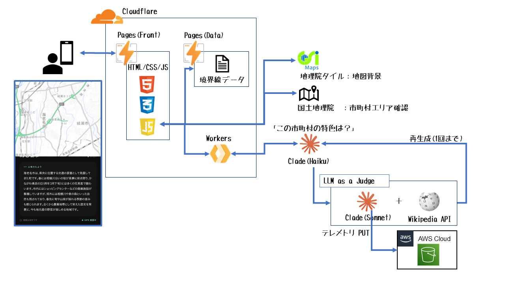

# trip-road

> 電車・徒歩の旅で現在地の市町村をリアルタイム判定し、Claude Haiku がその土地の二十四節気にあわせた解説を生成、Claude Sonnet 4.6 が4軸で品質判定して届けるスマホ Web アプリ（PWA）。

🌐 **本番**: <https://trip-road.tetutetu214.com>

## できること

- 📍 GPS で「いる市町村」を自動判定（Turf.js Point-in-Polygon + 国土地理院逆ジオコーダのフォールバック）
- 📜 Claude Haiku が「**土地のたより**」を 120〜180 字で生成。歴史・名物・地形は具体的に、季節は二十四節気（24 区分）の name + period を埋め込んで指示
- 🧐 Claude Sonnet 4.6 が **4 軸並列で品質判定（LLM as a judge）** し、不合格なら指摘内容を渡して 1 回だけ書き直し
   - 軸1: 事実正確性（Wikipedia API の intro を根拠資料として埋込・30 日キャッシュ）
   - 軸2: 具体性（汎用フレーズの混入を引用列挙して減点）
   - 軸3: 季節整合（二十四節気の period に矛盾する記述を引用列挙）
   - 軸4: 情報密度（情緒修飾に字数を取られていないか）
- 🗺️ Leaflet + 地理院タイル（淡色）で地図表示、ティールの軌跡ポリラインで通過跡を描画
- 🏆 訪問済み市町村の制覇カウント（localStorage に永続化）
- 📡 テレメトリは AWS S3 に SigV4 署名付きで自動 PUT（`year=YYYY/month=MM/day=DD/` パーティション）。判定スコアと dwell_ms を蓄積して `docs/analysis/fetch_entries.sh` で集計
- 📱 iPhone Safari の「ホーム画面に追加」でスタンドアロンモード起動可能
- 🎨 ダークテーマ + glassmorphism のフロートチップ、生成中→確認中→書き直し中の段階表示

### 生成される「土地のたより」例（埼玉県久喜市・立春〜雨水ごろ）

> 久喜市は埼玉県東部に位置し、利根川沿いの豊かな自然が特徴です。春には市内の桜並木が満開となり、古利根川周辺の景観が一層引き立ちます。江戸時代の宿場町として栄えた歴史を持ち、現在も趣深い町並みが残っています。春の新鮮な野菜や山菜が旬を迎える季節、地元産の食材を使った料理も味わえます。

## アーキテクチャ

3 つの Cloudflare サービス（Pages × 2 + Workers）+ Anthropic API（Haiku 生成 + Sonnet 4.6 Judge）+ Wikipedia API（RAG）+ AWS S3（テレメトリ Sink）で構成。バックエンド DB は持たず、状態は localStorage に集約。



主要な通信経路は次のとおり。

- **ブラウザ → Cloudflare Pages (Front)**: アプリ本体（HTML/CSS/JS）のダウンロード
- **ブラウザ JS → Cloudflare Pages (Data)**: 市町村境界線 GeoJSON / `adjacency.json` の取得（Workers は経由しない）
- **ブラウザ JS → Cloudflare Workers**: `X-App-Password` 認証付きで `/api/describe`（生成 + Judge）と `/api/telemetry`（S3 中継）を呼出
- **ブラウザ JS → 国土地理院**: 地図タイル PNG と P-in-P フォールバック用の逆ジオコーダ（公開 API、Workers は経由しない）
- **Workers → Anthropic API**: Haiku で生成、Sonnet 4.6 で 4 軸並列 Judge、不合格なら 1 回だけ指摘付き再生成
- **Workers → Wikipedia API**: Judge 軸 1（事実正確性）の根拠資料、Workers Cache API で 30 日キャッシュ
- **Workers → AWS S3**: テレメトリを `aws4fetch` で SigV4 署名付き PUT

元データ N03（行政区域データ）の出典は国土交通省。

## 技術スタック

| レイヤー | 採用技術 | バージョン |
|---|---|---|
| フロント | Vanilla JS (ES Modules) + Leaflet + Turf.js | Leaflet 1.9.4, Turf 7.x（CDN） |
| バックエンド | Cloudflare Workers | wrangler 4.x |
| LLM（生成） | Claude Haiku | `claude-haiku-4-5-20251001` |
| LLM（Judge） | Claude Sonnet 4.6 | `claude-sonnet-4-6` エイリアス |
| RAG | Wikipedia API（intro extracts） | Workers Cache API 30 日 TTL |
| テレメトリ Sink | AWS S3 + aws4fetch（SigV4） | 1.0.x |
| 静的配信 | Cloudflare Pages | — |
| データ前処理 | Python + geopandas + shapely | Python 3.12 |
| 単体テスト | vitest | 1.6 |
| E2E テスト | Playwright | 1.59 |

## リポジトリ構成

```
trip-road/
├── public/                # Cloudflare Pages デプロイ対象
│   ├── index.html
│   ├── manifest.json
│   ├── icon-180.png
│   └── assets/            # JS モジュール（season/cache/storage/telemetry/ui/api/app など） + app.css
├── workers/               # Cloudflare Workers（認証 + 生成 + Judge + S3 送信）
│   ├── src/
│   │   ├── index.js              # ルーティング (auth / cors / describe / telemetry)
│   │   ├── auth.js               # X-App-Password 定数時間比較
│   │   ├── cors.js               # プリフライト + ヘッダ
│   │   ├── anthropic.js          # Haiku 用プロンプト組立 + 再生成フィードバック注入
│   │   ├── describe_flow.js      # 生成→Judge→1回だけ再生成のオーケストレーター
│   │   ├── judge.js              # 4 軸並列 Judge + fail-open
│   │   ├── judge_prompts.js      # 4 軸別プロンプト + Few-shot キャリブレーション
│   │   ├── wikipedia.js          # Wikipedia API クライアント + Cache API 30 日
│   │   └── aws.js                # S3 SigV4 PUT（aws4fetch ラッパ）
│   ├── test/                     # vitest 97 テスト（8 ファイル）
│   └── *.sh                      # 運用スクリプト
├── preprocess/            # N03 データ前処理（Python）
│   ├── helpers.py / split_and_simplify.py / build_adjacency.py
│   └── *.sh               # 運用スクリプト
├── test/                  # フロント単体テスト（vitest 41 テスト、6 ファイル）
├── tests/e2e/             # Playwright E2E（4 シナリオ）
├── docs/                  # 計画・仕様・知見・モックアップ・分析
│   ├── plan.md
│   ├── spec.md
│   ├── knowledge.md
│   ├── todo.md
│   ├── plans/             # フェーズ別実装プラン（Plan A〜F）
│   ├── analysis/          # S3 集計スクリプト + LLM 分析プロンプト
│   └── design/            # モックアップ HTML + コンセプト
├── deploy_frontend.sh
└── README.md              # このファイル
```

## 開発

### 前提

- Node.js v18 以上
- Python 3.12（前処理スクリプトを再実行する場合のみ）
- ローカル開発用シークレット `~/.secrets/trip-road.env`:
  ```
  ANTHROPIC_API_KEY=sk-ant-...
  APP_PASSWORD=<32文字hex>
  ALLOWED_ORIGIN=https://trip-road.tetutetu214.com
  ```
- Workers Secrets（本番は `wrangler secret put` で個別登録）:
  - `ANTHROPIC_API_KEY`（Haiku 生成 + Sonnet 4.6 Judge で共用）
  - `APP_PASSWORD`
  - `ALLOWED_ORIGIN`
  - `AWS_ACCESS_KEY_ID` / `AWS_SECRET_ACCESS_KEY` / `AWS_REGION` / `S3_TELEMETRY_BUCKET`（テレメトリ Sink 用、最小権限 IAM）

### セットアップ

```bash
git clone https://github.com/tetutetu214/trip-road.git
cd trip-road
npm install
cd workers && npm install && cd ..
```

### テスト

```bash
# フロント単体テスト（41 テスト、6 ファイル）
npm test

# Workers 単体テスト（97 テスト、8 ファイル）
cd workers && npm test && cd ..

# E2E テスト（Playwright、4 テスト、本番ドメインに対して実行）
source ~/.secrets/trip-road.env
npm run test:e2e
```

### ローカル動作確認

```bash
npm run serve
# → http://localhost:8000 をブラウザで開く
# 注: ローカルからは Workers の CORS 制約で LLM 呼出が失敗するが、
# UI と GPS 動作は確認可能
```

### デプロイ

```bash
# フロント (Cloudflare Pages → trip-road.tetutetu214.com)
bash deploy_frontend.sh

# Workers API (Cloudflare Workers → trip-road-api.tetutetu214.com)
cd workers && bash deploy_production.sh

# データ前処理（再生成する場合のみ、Google Cloud Shell や WSL で）
cd preprocess
source .venv/bin/activate
bash run_split.sh         # N03 分割（15〜30 分）
bash run_adjacency.sh     # 隣接マスタ生成（3〜5 分）
bash run_deploy.sh        # Cloudflare Pages → trip-road-data.tetutetu214.com
```

### S3 テレメトリ集計

```bash
# 直近の S3 entry をローカルに JSONL で集約 + サマリ表示
bash docs/analysis/fetch_entries.sh
```

## ドキュメント

| ファイル | 内容 |
|---|---|
| `docs/plan.md` | 開発計画・アーキテクチャ・マイルストーン |
| `docs/spec.md` | 機能・API・データ・UI 仕様（実装の原典） |
| `docs/knowledge.md` | 設計判断・トレードオフ・ハマリポイント・実装知見 |
| `docs/todo.md` | タスク一覧・将来的な改善 |
| `docs/plans/` | フェーズ別の実装プラン（Plan A〜F） |
| `docs/analysis/` | S3 集計スクリプト + LLM 分析プロンプト |
| `docs/design/` | デザインモックアップ HTML + コンセプト |
| `memo.txt` | 元の要件定義書（v0.3） |

## 開発フェーズ

| フェーズ | 内容 | ステータス |
|---|---|---|
| **Phase 0** | 環境準備（Anthropic / Cloudflare / Wrangler） | ✅ |
| **Phase 1** | N03 データ前処理 + Cloudflare Pages 配信 | ✅ |
| **Phase 2** | Cloudflare Workers API（認証 + Anthropic プロキシ） | ✅ |
| **Phase 3** | フロントエンド実装（Vanilla JS + Leaflet + Turf.js） | ✅ |
| **Phase 4** | Cloudflare Pages デプロイ + 独自ドメイン + iPhone 実機 | ✅ |
| **Phase 5 / Plan D** | テレメトリ + AWS S3 Sink + LLM 分析セットアップ | ✅ |
| **Phase 6 / Plan E** | LLM as a judge（Sonnet 4.6 + Wikipedia RAG + 4 軸並列評価 + 再生成） | ✅ |
| **Plan F** | Plan E 完成度向上（政令市の区対応、文字数遵守率、観測強化） | 計画中 |

詳細は `docs/plans/` の各 Plan ファイルを参照。

## テスト

| 種別 | 件数 | 場所 | 対象 |
|---|---|---|---|
| vitest 単体（フロント） | 41 | `test/` | 純粋関数（season/cache/storage/telemetry/ui） |
| vitest 単体（Workers） | 97 | `workers/test/` | 認証・CORS・Anthropic・Judge・Wikipedia・S3・describe_flow |
| Playwright E2E | 4 | `tests/e2e/` | 本番ドメインへの全機能 E2E |
| **合計** | **142** | | |

## ライセンス・出典

このプロジェクトは個人の PoC ですが、以下の OSS とデータを利用しています：

- [Leaflet.js](https://github.com/Leaflet/Leaflet) — BSD-2-Clause
- [Turf.js](https://github.com/Turfjs/turf) — MIT
- [geopandas](https://github.com/geopandas/geopandas) — BSD-3-Clause
- [shapely](https://github.com/shapely/shapely) — BSD-3-Clause
- [aws4fetch](https://github.com/mhart/aws4fetch) — MIT
- 国土数値情報 N03（行政区域データ）— PDL1.0 ©国土交通省を加工して作成
- 地理院タイル — PDL1.0 ©国土地理院
- Wikipedia 日本語版 — CC BY-SA 4.0（Judge の事実正確性軸の根拠資料として利用）

## 開発履歴

[プロジェクト初期化](https://github.com/tetutetu214/trip-road/commit/4575814) から Phase 6 / Plan E 完了（2026-05-03、Sonnet 4.6 + Wikipedia RAG による品質判定が本番反映）まで、ブレインストーミング → 設計 → 実装 → 実機検証を Anthropic Claude Code (Opus 4.7) との協業で進めました。

主な技術判断・知見は `docs/knowledge.md` に記録しています。
